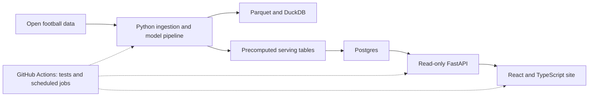

# PitchLens

PitchLens is a planned, public football analytics project by **João Meira**. The goal is to build an explainable analytics site: create and evaluate an expected-goals (xG) model, publish readable match reports, and later track the performance of team forecasts.

The guiding rule is: **show the numbers and show the method**. Conventional, tested code produces every statistic and probability. AI may describe computed results, but it must never invent them.

> **Project status:** planning and documentation only. This repository does not yet contain the application, pipeline, or runnable development commands. The implementation layout and stack below are the agreed direction from the project plan, not existing code.

## Project Documents

- [Project plan](docs/PitchLens-ProjectPlan.html): scope, data, architecture, stack, testing, and 16-week plan.
- [Learning roadmap](docs/PitchLens-roadmap.html): topics to learn, in order, with ownership and completion criteria.

## What We Are Building

### MVP: a static analytics core

The first public version should let someone choose a match and understand more than the final score. It includes:

- A reproducible dataset built from StatsBomb open event data for 2–3 competitions.
- An xG v1 model using logistic regression, evaluated with log loss, Brier score, and calibration plots, and compared with StatsBomb xG.
- Match pages with a shot map, cumulative xG timeline, pass network, and key statistics.
- A competition page with team xG for and against, including per-90 context and sample-size caveats.
- A plain-language methods page describing the data, model, evaluation, and limitations.
- Automated tests and a deployed public site.

The MVP is the priority. Forecasts and AI match notes come after it; the video-analysis lab is optional and starts only after launch.

### Planned follow-on work

1. **Live forecasts:** Elo and Dixon–Coles models, backtests, and a public forecast track record.
2. **AI match notes:** offline summaries grounded in computed match data, with automated checks for every claim and number.
3. **Launch polish:** accessibility, performance, documentation, demo, and an archive export so the project can remain available without live services.
4. **Optional video lab:** analyze a short clip of your own match for player tracking and heatmaps. Do not use broadcast footage; get consent from people shown.

## Ownership

**João Meira** owns all of the work: data ingestion and contracts, football analysis, xG and forecast models, analytical write-ups, API, frontend, CI/CD, deployment, and AI integration. The project plan, roadmap and kickoff guide in `docs/` were written for two people (Person A and Person B); both roles now belong to João.

Keep work in small GitHub issues and pull requests, and record meaningful technical decisions as short ADRs in `docs/adr/`.

## Step By Step: Start Here

### Week 1: foundations

1. **Agree the starting scope.** Choose the first 2–3 StatsBomb competitions and confirm the non-commercial, public portfolio goal. Keep forecasts, AI notes, and video out of the first release.
2. **Set up the workflow.** Create or confirm the GitHub repository, add a Projects board, create small issues for this week's tasks, and protect `main`.
3. **Learn the data path.** Register for StatsBomb open data, read its event specification, load one match in a notebook, and make a shot map with `mplsoccer`. Check the 120 × 80 coordinate convention and include attribution.
4. **Establish the development path.** Scaffold the planned monorepo, add `uv`, `ruff`, `mypy`, pre-commit, a basic GitHub Actions CI workflow, Docker Compose for local Postgres, and a first mockup of the match page.
5. **Define the first data contract.** Define the internal pitch-coordinate convention and write a small tested conversion example. Draft the API shape and example match JSON before anything depends on it.
6. **Check the result.** Clone the repository from scratch on each machine you use, run the setup, and confirm CI passes. Record the decisions and create the Week 2–3 issues.

**Week 1 is complete when** the repository runs locally from a fresh clone, CI is green, and the shot-map notebook and match-page mockup exist.

### 16-week delivery sequence

| Phase                   | Timing      | Main work                                                                                                     | Exit check                                                                  |
| ----------------------- | ----------- | ------------------------------------------------------------------------------------------------------------- | --------------------------------------------------------------------------- |
| 0. Foundations          | Week 1      | Repository workflow, tooling, CI, first shot map and match-page mockup.                                       | The repo runs from a fresh clone; CI passes.                                |
| 1. Data foundations     | Weeks 2–3   | Ingest 2–3 competitions, store Parquet, validate data, add cached downloads and fixture tests.                | One command rebuilds the dataset and CI validates it.                       |
| 2. xG model v1          | Weeks 4–6   | Engineer shot features, train and evaluate logistic regression, document limitations, prepare serving schema. | Model card and first analysis draft are ready.                              |
| 3. App MVP              | Weeks 7–9   | Build the read-only API, match and competition pages, charts, tests, and deployment.                          | A stranger can use the public MVP. This is the planned safe stopping point. |
| 4. Forecasts            | Weeks 10–11 | Add historical backtests, Elo then Dixon–Coles, scheduled updates, and score tracking.                        | Scheduled job runs twice unattended; track record is visible.               |
| 5. AI match notes       | Weeks 12–13 | Generate notes offline from computed stats and verify all claims.                                             | Every published note passes the faithfulness check.                         |
| 6. Polish and launch    | Weeks 14–16 | Accessibility, performance, final write-ups, demo, README, and archive mode.                                  | The project is ready to share as a portfolio.                               |
| 7. Video lab (optional) | Weeks 17–22 | Track players from a short, permitted clip and evaluate positional accuracy.                                  | Heatmaps and distances include a published accuracy figure.                 |

The timings were estimated for two people working roughly 6–10 hours each per week; with one person, expect them to stretch. Ship the MVP before adding follow-on features.

## Planned Architecture

Batch processing keeps the site simple: ingest and validate data offline, compute models and aggregates in the pipeline, and serve precomputed results through a read-only API.

Planned stack: Python 3.12+, `uv`, pandas, Parquet, DuckDB, pandera, scikit-learn, statsmodels, FastAPI, Pydantic, Postgres, React, TypeScript, Vite, and GitHub Actions. Hosting is planned around Vercel, Cloud Run, and Supabase; confirm current free-tier terms and costs before setup.

## Data, Methods, and Attribution

- StatsBomb open data is the planned source for the static analytics core. Review its current terms before publishing. Credit StatsBomb and use its logo on published material as required by its user agreement.
- Maintain a `DATA_SOURCES.md` with source, licence or terms link, last-checked date, and required attribution.
- Do not scrape or republish sources whose terms do not permit it.
- Document data coverage and limitations. Open data is a selected sample, not a complete view of football.
- Evaluate probabilities honestly and prevent leakage: split model data by match or season, and never use information that would not be available at prediction time.
- Keep event-level analysis data in Parquet; publish only the tables the site needs.

## Development Setup

There are no application setup commands yet because the implementation has not been scaffolded. The first implementation task is the Week 1 foundation work above. Once the project files exist, add the verified install, test, and run commands here rather than documenting commands that do not work yet.

## Definition of Done

- A fresh clone can reproduce the dataset and run the relevant tests.
- Data contracts and tests catch invalid coordinates, duplicate events, and broken probability invariants.
- Model metrics, baselines, and limitations are published with the methods.
- The public app works on mobile and with a keyboard, and charts are explained for non-experts.
- AI-generated text is labelled and every number is checked against computed input.
- Data attribution is visible wherever data or charts are published.
